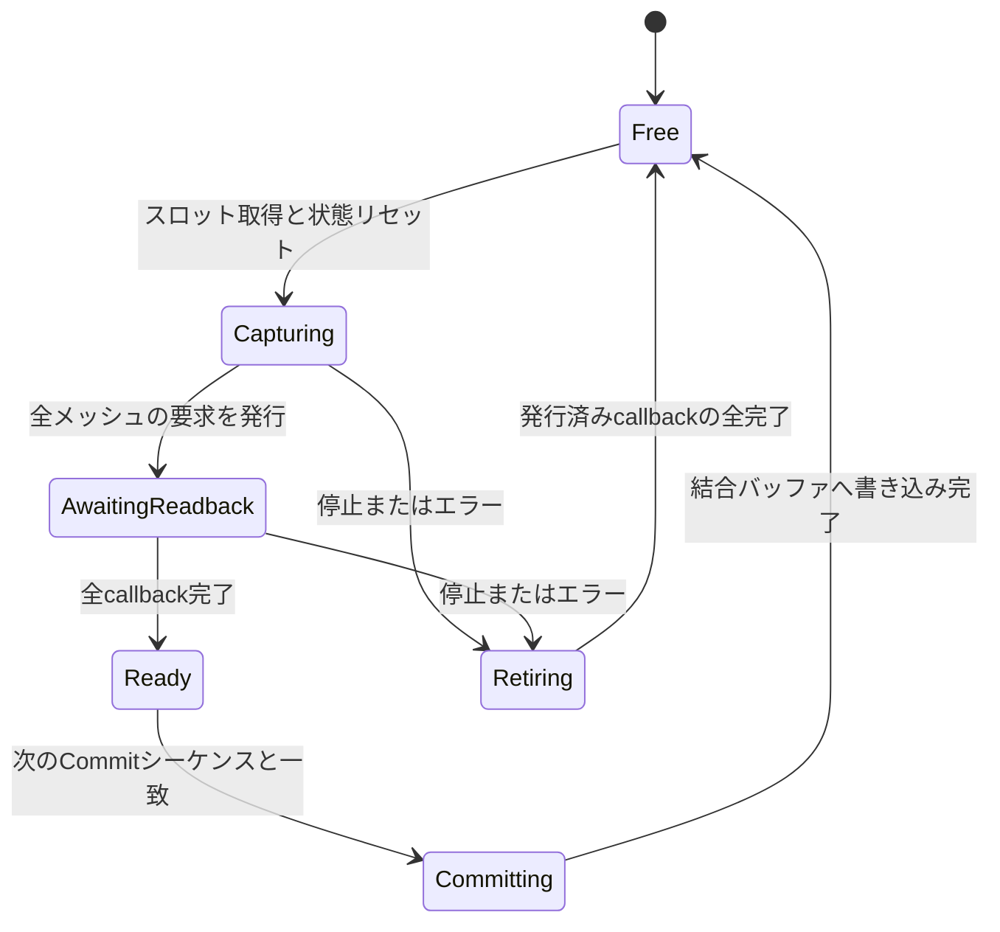

# Senderのヒープ領域再利用設計

状態: 一部実装済み。2026-10-03のKAGURA収録・性能測定に基づく。PCMリングとTimeWireの数値経路・DSP mailboxは実装済み。GPU readbackとパケット／チャンクのプールは設計案である。

## 目的と方針

準備時に必要なヒープ領域を確保し、収録中は同じ領域を循環して使う。大きな配列、フレーム状態、パケット用コンテナーを保持し、処理完了時には使用長と状態をリセットして返却する。確保した領域の参照はセッションが所有し続ける。

対象はStreamingMeshとDSP入力アダプターの継続処理である。Unity Editor、Inspector、通信API、圧縮ライブラリ等が行う確保も同じ実行環境のGCに影響するため、アプリケーション全体のGC回数は改修後に測定する。既存APIの内部確保まで含めた絶対的なGC不発生は、この設計だけでは保証しない。

## 現状の確保と測定

- `STMHttpSender.OnTiledReadback`／`OnDeltaReadback`は、各メッシュの配列をフレームごとに新規確保する。`EncoderBuffers`にもreadback配列があるが、現在のコールバックはそれを利用していない。
- `PendingEncodeFrame`とその配列、`CommitFrame`のpayloadリスト、TilePacker、`PackToByteArray`／`getIndices`の配列、`ToArray`、`AddHeader`の出力配列が短命なオブジェクトを生成する。
- 結合payloadのリストは圧縮完了後に再利用する仕組みが一部ある。ただし初回の容量拡張、圧縮入力配列、MemoryStreamの拡張と`ToArray`、未完了の送信キューは別途残る。
- 改修前の`STMAudioRecorder`はPCMブロックごとにbyte配列を作り、キューのlockとイベント通知を音声スレッドで行っていた。現在は固定バイトリングへ直接変換する。TimeWireのDSP入力も、生の時刻を固定mailboxへ記録する実装へ変更済みである。

同じEditorで30fps、サブフレーム9、300枚結合を測定した。Profilerの確保量にはEditorとワーカースレッドも含まれる。最初の2秒を除いたフレーム間隔・確保量と、測定全体のGC回数を示す。

| 条件 | 測定時間 | managed確保量 | GC回数 | 25ms超のフレーム / GC完了と重複 |
| --- | ---: | ---: | ---: | ---: |
| TimeWire＋Timeline再生のみ | 45秒 | 約16.5MB/s | 22 | 17 / 17 |
| メッシュ・音声収録＋送信 | 60秒 | 約47.1MB/s | 67 | 63 / 61 |
| 音声収録のみ・送信なし | 45秒 | 約18.4MB/s | 20 | 19 / 19 |
| Timelineの補正を無効化、DSP観測は有効 | 45秒 | 約17.2MB/s | 19 | 18 / 18 |
| Timeline補正とDSP観測を無効化 | 45秒 | 約17.0MB/s | 18 | 17 / 17 |
| TimeWire＋Timeline再生、Inspectorの選択なし | 30秒 | 約8.8MB/s | 6 | 4 / 4 |

収録時のベイク時間は最大約0.52msだった。一方、音声コールバックの通常周期は1024 / 48000 = 約21.33msだが、メッシュ・音声収録＋送信では最大約56.25msの間隔が発生した。DSPサンプル時刻は連続した。GCとの重複は強く観測されたが、スピーカー出力のunderrun自体は測定していない。

追加の「Inspectorの選択なし・メッシュと音声収録・音声送信なし」では約36.8MB/sの確保が残り、音声コールバック間隔は最大約88.75msだった。約59.57秒で観測差が−263.94msとなってクロック世代が変わり、Senderは収録停止を通知した。Inspectorを外すだけで解消する問題ではない。この追加測定は音声送信も無効なので、送信ありの測定との量的な差をInspectorだけの効果とは解釈しない。

測定データは`Logs/KaguraSenderPerformance_*/`のCSV・configuration.json・analysis.jsonに保存した。計測用MonoBehaviourはEditor限定で、シーンには保存しない。`Tools/analyze_kagura_sender_performance.py`で再解析できる。

## セッションが所有する領域

| 領域 | 所有者 | 再利用単位 | 返却条件 |
| --- | --- | --- | --- |
| CPU readback用の頂点配列 | FrameSlot | フレームスロットごと・メッシュごと | 全readback完了後、順序どおりのCommit完了 |
| フレーム状態・readback callback状態 | FrameSlot | 固定スロット | 同上。キャンセル時もcallbackの完了を待つ |
| キーフレームのtile分類・並び順 | CommitScratch | 逐次Commit共通 | そのフレームの結合バッファへの書き込み完了 |
| 非圧縮チャンク・フレームサイズ表 | RawChunkSlot | チャンクスロット | 圧縮処理が入力を使い終えた時点 |
| 圧縮済みpayload | EncodedChunkSlot | 送信スロット | 使用している送信処理の終了・破棄通知後 |
| PCM＋最初のDSP開始時刻 | Pcm16RingBuffer | 固定バイトリング上の有効範囲 | FFmpegのstdinへの書き込み完了 |
| DSP観測の生データ | DspObservationSlot | 固定スロット | メインスレッドが読み終えた時点 |

それぞれの寿命が違うので、フレームからHTTP送信まで同じスロットを占有させない。短いreadback待ちと長いネットワーク待ちを個別に制限する。

## GPU readback: フレーム単位のリング

初期値は`maxPendingReadbacks`に対応する8スロット。各スロットに13メッシュ分のkey／delta配列、頂点数、PTS、シーケンス、録画世代、未完了readback数、エラー状態を保持する。

- シーケンス順にCommitする。callbackが先に返った後続フレームはReadyのまま保持する。
- 空きがないときは新しいキャプチャを待つ。待ち明けは現在の時計を読み、欠落した取得枠を数える。すでに取得した差分フレームの途中を捨てない。
- スロットはreadback完了とCommit完了の両方を満たしてから再利用する。メッシュごとの単一配列の使い回しでは、複数フレームの同時readbackを保持できない。
- 初期実装は既存の`AsyncGPUReadback.Request`を維持し、返却データをスロット所有のmanaged配列へコピーする。GPU計算とCPUデータの所有権の変更を分けて検証する。
- callbackを準備時にスロットとメッシュへ結び付け、フレームごとのクロージャ生成も減らす。再発行は前の要求完了後に限定する。
- callbackには要求時の世代とスロットのチケットを対応付ける。古いcallbackは現セッションの値を書き換えず、古い要求の完了管理と返却だけを行う。

今回のKAGURAは23,489頂点。key配列20byte／頂点、delta配列12byte／頂点を8スロットに持たせると、頂点配列本体は約6.01MB。現在の30fps・key 1/10では、readback配列本体だけで毎秒約9.02MBを新しく確保する計算になる。この部分を同じ約6MBの領域で循環できる。

## パケット化・圧縮・送信

Commitは逐次実行なので、パケット化のscratchは共有できる。tile ID辞書、tile ID配列、頂点の連結順、`linedIndices`等を準備時に確保する。tileごとの短命なTilePacker／可変リストは、固定配列上の分類と順序情報で置き換える。tile IDのソート順とtile内の頂点順は既存形式を維持する。

ヘッダーと頂点payloadをRawChunkSlotの配列へ直接書き込む。中間のpayloadリスト、`payload.ToArray()`、ヘッダー用別配列を経由せず、有効長とフレームサイズを保持する。

容量は初期頂点数、キーフレーム頻度、Combined Framesから計算する。最悪ケースで全頂点が別tileに入ると、keyフレーム上限は`29 + 11 × 頂点数`byte、delta上限は`29 + 3 × 頂点数`byteとなる。チャンクにはフレームサイズ表も加える。現在の300枚／key 1/10では非圧縮チャンクの保守的な上限は約26.8MBとなる。

RawChunkSlotは初期案として「書き込み中1＋圧縮待ち／処理中2」の3スロット。圧縮出力側は「生成中1＋送信中1＋送信待ち1」の3スロットとし、出力の最大容量は別のメモリ予算として指定する。大きなCombined Frames設定では固定領域も増えるため、準備時に総メモリ予算を表示し、確保上限を超える設定は収録開始前に拒否する。

- 圧縮入力は完成したRawChunkSlotをそのまま読む。サイズ表の書き込みにも再利用scratchを使う。
- 圧縮用の出力領域とStream wrapperは再利用し、容量不足は明示的に通知する。
- 初期実装では既存GZipStreamによる独立したgzipチャンクを維持する。GZipStreamの内部状態の確保は別途測定し、再利用できる大きな領域から優先して改修する。
- 入力スロットは圧縮終了後に返却し、出力スロットは送信の終了通知まで保持する。
- 現在の`Send(byte[])`には有効長と完了通知の契約を追加する。`Send`への登録直後に配列を返却しない。配列容量全体を送信して末尾の古いデータを混入させない。
- 送信待ちにも上限を設ける。現在の圧縮待ち上限だけでは、圧縮済みpayloadが送信キューへ積み上がることを防げない。
- 常駐workerと固定ジョブ記述を利用し、チャンクごとの大きな配列とTaskクロージャの継続生成を減らす。Unityの通信API内部のコピーと確保は測定対象とする。

## 音声とDSP観測

PCMは`Pcm16RingBuffer`の固定バイトリングへ、音声スレッドが直接16bit stereo変換して書き、writer threadが読む。セッション開始時に容量を決めて確保する。FFmpegへの同期Writeが完了するまで読み取り位置を進めず、使用中の範囲をproducerへ返却しない。可変のコールバック長にも対応し、折り返した範囲は分割して送る。配列を増やしたり別配列へコピーしたりしない。最初に受け付けたブロックのDSP開始時刻も保持する。

現在の1024サンプル／48kHz／stereo 16bitでは1ブロック4096byte。8秒の待ち容量は1,536,000byte（375ブロック相当）となる。満杯・不完全な入力・producerの重複では全ブロックを拒否し、以後のPCM受付を直ちに閉じる。メインスレッドでoverflowとSender停止を通知し、既に受け付けた範囲は排出する。出力サンプル数を無言で欠落させたまま収録を続けない。

producer／consumerは一つずつ。Volatileによるカーソル公開とInterlockedによるproducerの入退場で所有権を管理し、音声コールバック内のキューロック・イベント通知・新規PCM配列確保を除去した。空のときに1ms待つのはwriterだけで、音声スレッドは待たない。Stopは受付を閉じ、進行中のproducerと未送信PCMの終了を確認してからstdinを閉じる。音声構成変更・writerエラーでもSenderを停止する。

同じ容量の次の収録では配列を再利用する。wrapperは開始時に作り直し、古いcallbackが保持したwrapperは閉じたままにする。使用中・未排出の領域を別セッションへ再利用しない。

PCMの回帰テストは`Tools/Tests/AudioPcmRingBufferTests.cs`。mono／stereo／多チャンネル変換、折り返し、満杯、閉鎖、遅いWrite中の領域保護、2万ブロックの並行処理を検証した。.NETで準備後の1万ブロックは新規managed確保0byte、Unityで正のコントロール付きGC.Alloc計測の1,000ブロックは確保イベント0件だった。結果は`Logs/AudioPcmRingValidation/`に保存した。

単体テストは.NET 10 SDKで`dotnet run --project Tools/Tests/AudioPcmRingBufferTests.csproj --configuration Release`として実行できる。Unity上のFFmpeg統合試験はKAGURAのCreate Channel→Record from Start→Stop Recordingで行い、ring排出・writer終了・音声インデックスのサンプル数とデコード長を確認する。

Unity上でKAGURAを30秒収録したChannelは`DevData/channels/timewire_KAGURA_pcmring_20261003_104133/`。PCM overflowなし、停止後のring排出とwriter終了を確認した。メッシュ873フレームのシーケンス・PTSが正常、音声1,440,768サンプル（30.016秒）のインデックスとデコード長が一致した。楽曲4秒・10秒の波形は相関0.997以上で、両測定位置のオフセットは同じだった。これは短時間の経路検証であり、全曲や実機出力の同期保証ではない。

同じ短時間収録でもEditor全体では30回のGC、約42.5MB/sの確保が残った。PCM部分の確保を除去しても、メッシュreadback、パケット化、圧縮、送信、Inspector等によるGCが音声スレッドへ影響する可能性は残る。音声出力のスパイク全体が解消したという結果ではない。

DSP観測は音声スレッドで生のDSP値、Stopwatch tick、周波数、世代を固定領域へ記録する。TimeObservation／ClockTimeへの変換と補正はメインスレッドへ移す。複数フィールドを同時に読み書きして値が混在しないよう、固定スロットの所有権とpublish順序を管理する。最新観測だけを使う現在の用途では、既存のmailboxと同様の固定共有領域を維持できる。音声スレッドに可変リスト拡張、文字列変換、BigIntegerの一時領域、ファイル処理を持ち込まない。

TimeWireの受け渡し自体は、ObservationInboxが生成時に一度確保したクラスとlock用object、値型のTimeObservationフィールドを再利用している。Publish／TryTakeごとに新しい共有領域を作る設計ではない。ClockSnapshot、TimeObservation、ClockTimeはstructであり、通常の構築・受け渡しがそのままヒープ確保になるわけではない。

2026-10-03 に TimeWire のクロック内部を 1µs・Int64 の演算へ移行し、Core／NTP／OSC の実運用コードから BigInteger と汎用有理数クラスを除去した。乗算前に商と余りへ分解し、外部 timebase の小数部積だけ固定の2ワード値型で扱う。文字列加工・解析用の配列は使わず、double の利便性入力はスタック上の固定バッファで変換する。ClockRate の公開フィールドも long に変更した。詳細は独立パッケージの `Core/INT64_CLOCKS.ja.md` を参照する。

同じ改修で、音声スレッドは生のDSP時刻と整数の受領時刻を固定mailboxへ記録し、時刻変換と補正をメインスレッドへ移した。NTP／OSCの送受信・TCPフレーミング領域と既知セッション文字列も再利用する。元の通信形式は維持し、同期時計へ取り込む段階でマイクロ秒へ換算する。

ウォームアップ後の .NET 10 の同一入力測定では、FromSeconds 10,000回と Observe＋GetSnapshot 5,000回で数値処理の新規 managed 確保は0byteだった。1MB配列の確保で計測APIを検証し、計測用Stopwatchは測定前に生成した。Unity 6000.6.3f1 でも、正のコントロール付き GC.Alloc 回帰テストが成功し、時計・Transport・速度補正・FrameSchedule・ループ処理1,000回で確保イベント0件を確認した。GC.Alloc のsample.Valueは処理時間なので、byte数ではなくsample.Countによるイベント数を使った。結果は `Logs/TimeWireInt64Migration/` に保存している。

この結果は TimeWire のウォームアップ後の数値経路の検証であり、Sender全体のGCや音声途切れが解消したことを意味しない。PCMの再利用は上記のとおり実装済み。StreamingMeshのreadback配列、チャンクの再利用は引き続きこの文書の実装計画に従う。未知セッション、接続開始、例外、Unity／ソケット内部等の確保も残る。

大きな観測差を時計の実際の不連続と分類する方法は、バッファ再利用の効果測定と合わせて検証する。音声処理の遅延から世代変更・Timelineの再起動へ進む経路も確認する。

## 準備・停止・構成変更

1. Create Channel等の準備で、対象メッシュ、頂点数、同時処理数、結合枚数、PCMブロックサイズから容量を決める。使用領域とコンテナーを確保し、プールを初期化する。
2. Record開始時は準備済み領域の状態と使用長をリセットする。収録中に上限を越える要求では新しい領域を増やさず、待ち・停止・再準備を通知する。
3. Stopでは新規取得を停止し、発行済みreadback、Commit、最後のチャンク圧縮、PCM writer、送信を順に排出する。
4. 全所有権の返却を確認して次の収録を開始する。頂点数、対象メッシュ、スロット数等が変わる場合は、使用中の領域を残したまま再構成しない。
5. 世代変更・例外・キャンセルでも、使用中のスロットを即時にFreeへ戻さない。後着callback、worker、送信側からの使用終了を待つ。
6. セッション終了で領域を解放する。GPU／Native領域を導入する段階では、異常終了時も使用中領域の解放を完了後まで遅らせる所有者を用意する。

## 実装順と確認条件

1. **FrameSlotリングとreadback配列の再利用**。異なるcallback完了順、複数in-flight、Stop／Restart、古い世代、エラーを検証する。
2. **CommitScratchとRawChunkSlot**。同じ入力頂点から生成したkey／deltaのバイナリを既存実装と比較する。PTS、シーケンス、tile内順序を維持する。
3. **圧縮出力と送信の所有権・待ち上限**。遅い送信、失敗、キャンセル時にメモリが上限内で止まり、使用中データが変化しないことを検証する。
4. **PCMリングと生DSP観測の固定領域**。音声サンプルの連続性、first PCM原点、観測値の混在防止、overflow、音声設定変更を確認する。
5. **KAGURA再収録と同条件の性能比較**。準備時と収録中を分け、managed確保量、GC回数・停止時間、音声コールバック間隔、Observation Drift、欠落取得枠を測る。Editor／Inspector由来の分も別条件で比較する。

確認する成果は、事前に確保した領域が継続処理で再利用されること、処理待ちによってメモリが無制限に増えないこと、GCに重なる音声遅延が改善することである。
