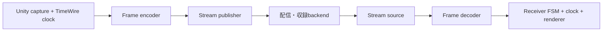

# フレーム単位のストリームとプロトコル分離

2026-10-04。**設計仕様。以下の分離はまだ実装していない。**
[ライブ・アーカイブ設計](LIVE_ARCHIVE_DESIGN.md)と同時に適用する。
Sender／Receiverからファイル形式・ファイル配送を切り離し、
HTTP／HLS以外のフレーム送受信にも同じ収録・再生処理を使えるようにする。

## 共通境界はフレーム

上位の収録処理はUnityの姿勢を取り込み、時刻付きフレームをencoderへ渡す。
再生処理は時刻付きフレームをdecoderへ渡し、再生時計に合わせて描画する。
Controllerは`.stmj`、`.stmv`、`.stma`、`.m4s`、`.m4a`、URL、HTTPステータスを解釈しない。

フレームの論理単位、配送メッセージの単位、保存ファイルの単位を同じものにしない。
一つのメッセージに複数フレームをまとめても、一つの大きなフレームを複数メッセージに
分けても、Controllerへは完全なフレームとして渡す。通信断片と保存ファイルの分割は別。

## 責務と依存方向

| 層 | 担当 | 固有知識 |
| --- | --- | --- |
| Core / Unity | FSM、時計、track、PTS、取消、budget、capture／描画 | Unityの形状・リソース・再生操作 |
| Codec | フレームencode/decode、復元依存関係 | 頂点の量子化・K/D、AAC等 |
| Packaging | フレーム集合と保存／配送形式の変換 | STMのサイズ表、JSON目録、fMP4 |
| Compression | payloadの圧縮／展開 | GZip等、独立した圧縮単位と上限 |
| Session adapter | 公開範囲・能力・完了の正規化、送受信の編成 | ファイル型、メッセージ型、ログ型の処理差 |
| Transport | 接続、送受信、断片化、再接続、通信上限 | HTTP、WebSocket、DataChannel、Kafka client |
| Server backend | 受領、永続化、公開、完了、archive/delete | ファイル／ストレージ／ログと認証 |

依存は具体的adapter／codecからCoreの契約へ向ける。Coreから具体的通信SDKや
STM serializerを参照しない。composition rootで必要な実装を登録・注入する。
一つの巨大なTransport interfaceへHTTPのGET・Kafka offset・HLSタグを詰め込まない。

TimeWireの現行ローカルUPMではCore assemblyがUnityを参照せず、OSC側がCore／Unityを
参照する構成を確認した。同じ依存方向を採用する。TimeWireの`TransportClock`は
再生位置と速度を扱う時計であり、ネットワークtransportのinterfaceとして流用しない。

## 小さい共通契約と名称

| 契約 | 呼び出し元へ提供する内容 |
| --- | --- |
| `IStreamPublisher` | session開始、リソース公開、フレーム受け入れ、受領結果、drain |
| `IStreamSource` | 検証済みsession情報、公開範囲更新、取得範囲指定、完全フレーム供給、cancel |
| `IFrameCodec` | descriptorに対応するencoder／decoder生成、復元地点の解釈 |
| `IPayloadCompression` | 独立したpayload blockの圧縮／展開、最大展開サイズの検証 |
| `ISessionControl` | backendの収録完了・archive/delete、最終受領点の照合 |

時計は既存TimeWireの時計契約へ接続する。音声adapterは同じ収録時間軸の時計と
準備・seek完了・終了・失敗を提供し、固有URLの初期化はcomposition側へ移す。

上位Unity componentの候補名は`StreamingMeshEncoder`／`StreamingMeshDecoder`。
前者がcaptureと収録pipeline、後者が再生FSMと入力pipelineを構成する。
内部の変換処理は`VertexFrameEncoder`／`VertexFrameDecoder`など、
送受信処理はPublisher／Sourceと呼び、encoder自身に接続やHTTPを担当させない。
全protocolごとにSender／Receiver一式を複製しない。既存の名前に固定する必要もない。

`IStreamSource`は「ファイルを1個GETする」を公開APIにしない。
Controllerはtrack、希望するPTS範囲、cancel ID、budgetを指定する。
HTTP adapterは必要なファイルを選び、メッセージ型adapterは購読／creditを調整する。
供給側がpushする接続でも、再生処理は同じsource契約からフレームを取り出す。

`ISessionControl`はメディア配送と分離する。DataChannelで頂点を受けながら
HTTP RESTで状態監視・完了を行う組み合わせも可能にする。
REST完了APIはHTTP実装であり、CoreはPOSTのURLや応答JSONを組み立てない。
backendにアーカイブ機能がなければ、接続可能でも全区間seekを保証しない。

各契約の結果は共通の型付き結果へ変換する。公開HTTPの404はNotFoundとなり、
削除履歴を返さない。Kafka offsetの消失などを全てNotFoundへ機械的に変換しない。
範囲外、未対応機能、通信失敗を区別してFSMへ渡す。

## フレームとリソースの共通モデル

`EncodedFrame`はファイル名を持たず、次の意味情報とpayload leaseを持つ。

- session／track ID、再収録やdecoder変更を区別するepoch。
- track内sequence、PTSとtimebase、codec descriptorとその世代。
- 復元地点・依存関係。STM codecならK/Dと復元基準を表す。
- 有効なバイト範囲を持つpayload lease。

これはCoreのメモリ上の契約であり、全protocolへ同じJSONを強制するwire仕様ではない。
codecは実ヘッダーを照合し、transportの主張だけでKと判断しない。
PTSはcapture時刻であり、到着時刻やKafka offsetを再生時刻へ置き換えない。
有効終了がまだ分からない場合は次のPTSを待つ。収録の確定終端は完了情報で受け取る。
データ圧縮がある場合、sourceが展開してからEncodedFrameを供給する。
ここでEncodedは頂点等のcodec表現を意味し、GZip済みという意味にはしない。

Mesh／Material／Texture定義は内容ハッシュと依存リソースIDを持つResourceSetとして扱う。
共通モデルにURI連結や`stream.bin`のサイズ表を入れない。
実バイナリ形式とGPU形式の選択はresource codec／adapterへ置く。
復元地点が使うリソース・codec世代を揃えてからdecodeする。
接続先変更だけで同一内容のGPUリソースを再確保しない。

`.stma`は目録であり音声codecではない。現在の実データはAAC/fMP4のinit＋`.m4s`。
`.m4a`等への対応もcodecとpackagingの選択として扱う。
フレーム供給型音声はPTSとサンプル範囲を使う。OSのHLS playerが直接取得する経路は
専用adapterが時計／seek契約を満たし、ControllerへHLS URLを直接渡さない。
DataChannelへHLS URLを置き換えただけでOS playerが再生できるとは扱わない。

## HTTP／HLSと各protocolの配置

[HLS仕様](https://www.rfc-editor.org/rfc/rfc8216.html#section-2)はプレイリストとメディア
segmentを定める。現行の頂点stmj/stmv配送は独自形式であり、HLS準拠の頂点trackではない。
HTTPファイル配送と音声HLSを組み合わせたprofileとして扱う。

| Adapter | フレーム境界までの処理 | 完了・archive／seek |
| --- | --- | --- |
| HTTP＋STM | 状態／stmjからファイル選択、GZip・サイズ表を解いてsliceを供給 | REST＋永続archive目録 |
| HLS audio | init、m3u8、fMP4、native player／MSEと時計を接続 | ENDLISTと最終・seek可能範囲を正規化 |
| WebSocket | メッセージframing、受領結果、再購読、断片再構築 | applicationの保存・範囲APIがある場合 |
| WebRTC DataChannel | message上限、reassembly、credit、reliability | controlと保存backendを別途構成 |
| Kafka | trackとpartition、offsetの対応、consumerから供給 | retentionとPTS／復元地点の索引がある範囲 |

HTTPで全フレームを別々のbyte[]へコピーしない。一つの展開済みchunk lease内の
sliceとして供給し、最後のslice返却時に配列をプールへ戻す。
現在のEncodedChunkPoolの所有権モデルを活かす。
ファイル先読み3はHTTP adapterの設定であり、全protocolの3メッセージへ置き換えない。
共通budgetはencoded bytes、frame metadata件数、decode先読み時間とする。

frame push対応backendはライブ購読へ完成フレームを供給し、保存経路で
先頭K・通常末尾Dの規則に従うstmvを構築できる。
ライブ配送をstmv完成まで待たせない。全区間保存とライブ公開範囲は引き続き別管理。

## GZipとレイテンシ

頂点の量子化／差分codec、payload圧縮、protocol内の圧縮を別として扱う。
GZipを選ぶことと、何秒分をまとめてから送るかは別の設定である。

| 経路 | 圧縮単位・初期方針 |
| --- | --- |
| HTTPのstmv保存・取得 | codecで作ったチャンクを独立GZip blockにする現行profileを継続 |
| フレーム単位ライブ配送 | 無圧縮を比較基準にし、独立フレーム／小バッチの圧縮を評価 |
| サーバーのarchive保存 | 配送時の圧縮と別に、保存チャンクへ再pack・圧縮可能 |

フレーム配送で完成ファイル待ちをなくしても、圧縮バッチが満杯になるまで待てば
遅延が再発する。小バッチには最大フレーム数・バイト数・待機時間を指定し、
どれかの条件でflushする。capture終了／cancel時も無期限に残さない。
GZip streamのflushと完全なblock終端を区別し、Receiverがいつ展開できるかを契約にする。
初期のライブprofileでは独立blockを使い、session全体に続く圧縮辞書を必須にしない。
途中接続・seek・欠落後の復帰で、それ以前の圧縮データを要求しないようにする。

各profileは圧縮方式、scope、展開サイズ上限、辞書／codec世代を明示する。
圧縮後に小さくならない場合のraw fallbackもwireの識別情報で区別する。
展開後のサイズとハッシュを検証し、圧縮／展開scratchもメモリ予算へ算入する。
無圧縮・GZip・必要ならLZ4/Zstd等を比較し、SDK／platformの対応を確認してから採用する。
圧縮方式を通信名だけで決めず、CPU時間、転送量、実際の待機時間で選ぶ。

WebSocket拡張にも圧縮がある（[RFC 7692](https://www.rfc-editor.org/rfc/rfc7692.html)）。
[Kafkaのproducer設定](https://kafka.apache.org/41/configuration/producer-configs/#compression.type)も
バッチ圧縮を持ち、`linger.ms`はバッチ待ちに影響する。
applicationのGZipとprotocol／broker圧縮を重ねることを既定にしない。
native HLS／MSEのAAC payloadも、頂点と同じ圧縮処理へ無条件に通さない。

遅延の測定点はcapture、encode完了、batch待ち、圧縮完了、送信queue、backend受領、
Receiver受信、展開、decode、表示。各段階のp50/p95/p99、bytes、CPU時間、
lease使用量を記録する。送信前の処理時間と通信時間を一つの値にまとめない。
サーバー／クライアント間の時刻比較はTimeWireの基準・不確かさを考慮する。
同期していない時計の差を一方向遅延と断定しない。

## ACK、欠落、順序とメモリ

publish結果のqueue受け入れ、配送先受領、保存確定を区別する。
archive収録の完了はbackendが要求する保存確認と最終受領点照合後に行う。
socket send成功を永続化やReceiverの再生成功と見なさない。
[KafkaのACK](https://kafka.apache.org/41/design/design/)も保存条件へ対応付け、
broker受領とbackendのアーカイブ完成を同じものにしない。

順序はsession／track内のsequenceで検証し、複数trackの到着順をA/V時刻にしない。
Kafka partitionとoffsetはadapter内に留める。視聴者が同じconsumer groupで
フレームを分配される構成を、全視聴者への配信と混同しない。

DataChannelにはordered／再送設定、message上限、bufferedAmountがある
（[W3C仕様](https://www.w3.org/TR/webrtc/#rtcdatachannel)）。初期の差分codec profileは
順序と配送を保証する設定を要求する。欠落許容profileを追加する場合、依存を失ったDを
decodeせず、復元地点の再要求／次の有効Kへ移動する。
再要求非対応のsourceでは、次の地点まで待つか取得し直す。
並べ替え・再送・fragment待ちに件数、bytes、時間の上限を設ける。

途中fragment、reassembly、送信待ち、decoder workerのleaseもbudgetへ算入する。
巨大なKやTextureは通信上限に合わせて断片化できるが、論理リソースを複数保存ファイルへ
分割することとは区別する。未完成データはdecoderへ渡さない。
backpressureはcapture／取得・creditへ伝播させる。
古いDを無作為に捨てず、復元地点単位で回復する。
archive要求で送信データを失った場合は完全archiveとして完了しない。
cancel後のbufferは実際のI/O／workerが返却するまで再利用しない。
高頻度処理はboxing、LINQ、フレームごとのTask／byte[]生成を避け、ringとleaseを使う。
外部SDK内部のallocationまでゼロと保証する契約にはしない。

## 能力、モジュールと移行

範囲内／全区間seek、最新復帰、復元地点取得、完了・archive、必要codec／resource世代の
能力を接続時に検証する。検証済みdescriptorで持ち、Controllerへ可変boolを追加しない。
全区間seek可能archiveを公開するprofileには、対応sourceと範囲索引を必須にする。

Core、Unity、STM codec/packaging、compression、HTTP session/transport、HLS audio、
追加protocol adapterをasmdef／UPMの一方向依存で分ける。
WebGL非対応のnative SDKをCoreへリンクせず、Browser実装／gatewayをcompositionで選ぶ。
Kafka／WebSocket／WebRTCのSDK導入・実装はまだ行わない。

移行では次を一緒に分離する。

- `STMHttpSender`: capture、GPU codec、STM packing、圧縮、HTTP publisher。
- `STMHttpSerializer`: ResourceSet snapshot、format変換、URL／認証／送信。
- `STMAudioRecorder`: PCM capture、encoder、fMP4/HLS出力。
- `Receiver`: FSM／policyと、ChannelInfo解釈・HTTP取得・stmj/stma source。
- `EncodedChunkPool`: STM解析／GZipをadapterへ移し、共通ringはフレームsliceを保持。
- native HLS／Web MSE: 専用audio adapter。transport選択で時計の意味を変えない。

まずHTTP＋STM＋HLS profileを移し、WebGL／Androidで確認する。
Scene／Prefab／Editor toolingはGUIDと設定を明示的に移行する。
旧wire互換を不要とすることと、ユーザーのシーン設定を失ってよいことを混同しない。
本番protocolを同時追加せず、fake publisher/sourceで共通契約を検証する。

受入条件は同じcodecでファイル供給とフレーム供給の両方を再生できること、
Controllerに拡張子・HTTP・目録parser・GZipの分岐が残らないこと。
順序逆転、重複、欠落、codec世代変更、split message、未着resource、cancel中のACK、
背圧、archive seek、NotFound、保存失敗を検証する。
圧縮単位／待機時間の比較と、ファイル完成を待たない経路の遅延・メモリも測る。
