# フレーム単位のストリームとプロトコル分離

2026-10-04。**設計仕様。以下の分離はまだ実装していない。**
[ライブ・アーカイブ設計](LIVE_ARCHIVE_DESIGN.md)と同時に適用する。
Sender／Receiverからファイル形式・ファイル配送を切り離し、
HTTP／HLS以外のフレーム送受信にも同じ収録・再生処理を使えるようにする。

## 共通境界はフレーム

ユーザー指定の主データフローを、クラスと入出力型でも明示する。
Encoder／Decoderは生の頂点と符号化頂点の変換に限定する。
上位Controllerは`.stmj`、`.stmv`、`.stma`、`.m4s`、`.m4a`、URL、HTTPステータスを解釈しない。

```mermaid
flowchart LR
    Raw[生の頂点データ] --> Encoder[Vertex Encoder]
    Encoder --> Encoded[符号化頂点データ]
    Encoded --> Package[ContainerWriter]
    Package --> Compression[CompressionStage: GZip等 / None]
    Compression --> Container[配送用コンテナデータ]
    Container --> TransportOutput[TransportOutput]
    TransportOutput --> Network[通信経路・配信backend]
    Network --> TransportInput[TransportInput]
    TransportInput --> Received[受信コンテナデータ]
    Received --> Decompression[DecompressionStage: 展開 / None]
    Decompression --> Unpackage[ContainerReader]
    Unpackage --> Frames[符号化頂点データ]
    Frames --> Decoder[Vertex Decoder]
    Decoder --> Restored[復元頂点データ]
```



フレームの論理単位、配送メッセージの単位、保存ファイルの単位を同じものにしない。
一つのメッセージに複数フレームをまとめても、一つの大きなフレームを複数メッセージに
分けても、Controllerへは完全なフレームとして渡す。通信断片と保存ファイルの分割は別。
TransportOutput／TransportInputの入出力はコンテナであり、頂点フレームを直接encode/decodeしない。
低遅延profileでもこの境界を保ち、1フレームを即座に包める軽いコンテナを選ぶ。

## 主経路の6つの責務

| 役割・クラス候補 | 入力 → 出力 | 担当 | 担当しないこと |
| --- | --- | --- | --- |
| `IVertexFrameEncoder` / `StmVertexEncoder` | RawVertexFrame → EncodedVertexFrame | 量子化、K/D、符号化ヘッダー、codecの状態 | コンテナ集約、GZip、URL、送信 |
| `ContainerWriter` | EncodedVertexFrame → ContainerLease | serializer選択、境界計画、集約・flush | 頂点の量子化、接続、HTTP POST |
| `ITransportOutput` / `HttpTransportOutput` | 配送用ContainerLease → 送信受領結果 | 送信、背圧、protocolに応じた再送・通信断片化 | K/D生成、サイズ表、コンテナ内容の解釈 |
| `ITransportInput` / `HttpTransportInput` | 取得要求／購読 → 配送用ContainerLease | 受信、通信断片の再構築、cancel | GZip展開、サイズ表解析、頂点復元 |
| `ContainerReader` | 展開済みContainerLease → EncodedVertexFrame | profile照合、parser選択、sliceと所有権 | 接続・再送、頂点の復元計算、FSM遷移 |
| `IVertexFrameDecoder` / `StmVertexDecoder` | EncodedVertexFrame → DecodedVertexFrame | codec照合、K/D復元、CPU/GPU処理 | GET、目録polling、GZip、再生操作 |

上位の`CapturePipeline`／`PlaybackPipeline`はこの順序と各段階のbudget・cancelをつなぐ。
captureと時計はCapturePipelineの入力側、FSMと音声時計・描画はPlaybackPipelineの外側に置く。
Pipeline自身へ6役の処理を戻さず、各責務は別ファイル・別の実装として追えるようにする。
この6役に加えて、送信側のWriter後・通信前と、受信側の通信後・Reader前に
選択可能なCompressionStage／DecompressionStageを接続する。`None`ではそのまま渡す。
RendererはDecodedVertexFrameを再生時刻に合わせて提示し、コンテナを取得・解析しない。

ContainerWriterとContainerReaderは特定のコンテナの実装ではない。
`IContainerSerializer`／`IContainerParser`を注入し、`StmvContainerSerializer`／`StmvContainerParser`が
サイズ表とバイナリ配置を知る。Writer／Readerが形式の選択・寿命・flushを担当する。
GZipは`IPayloadCompression`を使う選択可能な処理としてPipelineへ接続する。
形式がコンテナ内部の個別block圧縮を規定する場合はWriter／Reader内の同じ処理を使う。
圧縮位置はprofileで確定し、外側と内側へ二重適用しない。
protocol自身の圧縮は通信adapter内で別に設定する。

## 責務と依存方向

| 層 | 担当 | 固有知識 |
| --- | --- | --- |
| Core / Unity | FSM、時計、track、PTS、取消、budget、capture／描画 | Unityの形状・リソース・再生操作 |
| Codec | フレームencode/decode、復元依存関係 | 頂点の量子化・K/D、AAC等 |
| Packaging | フレーム集合と保存／配送形式の変換 | STMのサイズ表、JSON目録、fMP4 |
| Compression | 頂点・リソース経路に選択して接続する圧縮／展開 | GZip／None等、処理位置・単位と展開上限 |
| Session adapter | 公開範囲・能力・完了の正規化、送受信の編成 | ファイル型、メッセージ型、ログ型の処理差 |
| Transport | 接続、送受信、断片化、再接続、通信上限 | HTTP、TCP、UDP、WebSocket、DataChannel、Kafka client |
| Server backend | 受領、永続化、公開、完了、archive/delete | ファイル／ストレージ／ログと認証 |

依存は具体的adapter／codecからCoreの契約へ向ける。Coreから具体的通信SDKや
STM serializerを参照しない。composition rootで必要な実装を登録・注入する。
一つの巨大なTransport interfaceへHTTPのGET・Kafka offset・HLSタグを詰め込まない。

TimeWireの現行ローカルUPMではCore assemblyがUnityを参照せず、OSC側がCore／Unityを
参照する構成を確認した。同じ依存方向を採用する。TimeWireの`TransportClock`は
再生位置と速度を扱う時計であり、ネットワークtransportのinterfaceとして流用しない。

## 小さい共通契約と名称

| 契約 | 呼び出し元へ提供する内容 |
| --- | --- |
| `IVertexFrameEncoder` / `IVertexFrameDecoder` | 頂点の符号化／復元とcodecの状態 |
| `IContainerSerializer` / `IContainerParser` | 符号化フレームとコンテナ配置の相互変換 |
| `ITransportOutput` / `ITransportInput` | コンテナ配送、受領結果、cancel、通信の背圧 |
| `ITransportSession` | 接続・認証・再接続・破棄を一度だけ管理し、Output／Inputを提供 |
| `IPayloadCompression` | 独立したpayload blockの圧縮／展開、最大展開サイズの検証 |
| `ISessionControl` | session開始・公開範囲、backendの完了・archive/delete、最終受領点の照合 |

時計は既存TimeWireの時計契約へ接続する。音声adapterは同じ収録時間軸の時計と
準備・seek完了・終了・失敗を提供し、固有URLの初期化はcomposition側へ移す。

上位Unity componentは`StreamingMeshSender`／`StreamingMeshReceiver`等のfacadeに留める。
前の案の`StreamingMeshEncoder`／`StreamingMeshDecoder`をpipeline全体の名前には使わない。
Encoder／Decoderは上表の変換クラス名とし、役割が名前で判別できるようにする。
全protocolごとにSender／Receiver一式を複製しない。

Controllerはtrack、希望するPTS範囲、cancel ID、budgetをPipelineへ指定する。
sessionの範囲索引から対象コンテナを解決し、TransportInputへopaqueな取得参照を渡す。
HTTPはファイル取得、メッセージ型protocolは購読／creditを実行する。
TransportInputという役名はアプリケーションのコンテナ受信側を表し、HTTP pollingだけを意味しない。
通知・メッセージ受信もTransportInputに閉じ込め、展開・ContainerReader以降の経路は変えない。

Output／Inputはコンテナの流れる方向であり、socketの片方向や通信開始側を表さない。
InputもHTTP GETや購読要求を送れ、OutputもACKを受け取れる。
TCP等の双方向接続では一つのTransportSessionから両方を提供し、
方向ごとに接続を二重生成しない。接続の寿命はcomposition側で一度だけ管理する。
通信のAPI・クラス名にPush／PullやPusher／Pullerは使用しない。

管理サーバーも同じ方向の契約を使い、収録データの受領にはTransportInput、
視聴者への配送にはTransportOutputを使う。`RecordingService`／`ArchiveStore`等が
受領・公開・保存の方針を担当し、通信方向の名前にその責務を含めない。
直接TCP／UDPで通信する構成では管理サーバーを必須にせず、必要なsession情報を
peer間で交換するadapterを選ぶ。直接接続だけでarchive／全区間seekを保証しない。

`ISessionControl`はメディア配送と分離する。DataChannelで頂点を受けながら
HTTP RESTで状態監視・完了を行う組み合わせも可能にする。
REST完了APIはHTTP実装であり、CoreはPOSTのURLや応答JSONを組み立てない。
backendにアーカイブ機能がなければ、接続可能でも全区間seekを保証しない。

各契約の結果は共通の型付き結果へ変換する。公開HTTPの404はNotFoundとなり、
削除履歴を返さない。Kafka offsetの消失などを全てNotFoundへ機械的に変換しない。
範囲外、未対応機能、通信失敗を区別してFSMへ渡す。

## フレームとリソースの共通モデル

`EncodedVertexFrame`はファイル名を持たず、次の意味情報とpayload leaseを持つ。

- session／track ID、再収録やdecoder変更を区別するepoch。
- track内sequence、PTSとtimebase、codec descriptorとその世代。
- 復元地点・依存関係。STM codecならK/Dと復元基準を表す。
- 有効なバイト範囲を持つpayload lease。

これはCoreのメモリ上の契約であり、全protocolへ同じJSONを強制するwire仕様ではない。
codecは実ヘッダーを照合し、transportの主張だけでKと判断しない。
PTSはcapture時刻であり、到着時刻やKafka offsetを再生時刻へ置き換えない。
有効終了がまだ分からない場合は次のPTSを待つ。収録の確定終端は完了情報で受け取る。
データ圧縮がある場合、選択した展開処理を通してからContainerReaderが符号化フレームを供給する。
ここでEncodedは頂点等のcodec表現を意味し、GZip済みという意味にはしない。

`ContainerLease`はprofile／format世代、コンテナID、有効bytes、内容ハッシュ等を持つ。
session側の索引にPTS・sequence範囲を持たせても、TransportOutput／TransportInputは配送用情報として
受け渡すだけで、K/Dやcodecヘッダーを解釈しない。HTTPのファイル名やKafkaの取得位置は
adapterのopaqueな参照へ変換し、codecへ渡さない。
leaseの所有権はencode、pack、通信、unpack、decodeの各境界で明示する。
借用slice、共有lease、所有権移譲を区別し、最後の利用者が返した時点だけで再利用する。
内容の同一性を示すハッシュと、圧縮後の配送bytesを検証するハッシュを区別する。
圧縮方式の変更だけでTexture等の同一リソースを別物として再確保しない。

通常ファイルの先頭K・末尾Dを保証するには、encode前に境界を計画する必要がある。
ContainerWriterはBoundaryPlanで復元地点の要求と予約先を決め、Encoderへ渡す。
Encoderが実際のK/Dを作り、ContainerWriterは結果を検証してまとめる。
すでに符号化されたDをpackerでKへ変えない。非同期完了でも同じ予約情報を引き継ぐ。
この制約はSTM profileの境界規則であり、全codec／コンテナへ末尾Dを強制しない。

Mesh／Material／Texture定義は内容ハッシュと依存リソースIDを持つResourceSetとして扱う。
共通モデルにURI連結や`stream.bin`のサイズ表を入れない。
実バイナリ形式とGPU形式の選択はresource codec／adapterへ置く。
復元地点が使うリソース・codec世代を揃えてからdecodeする。
接続先変更だけで同一内容のGPUリソースを再確保しない。

`.stma`は目録であり音声codecではない。現在の実データはAAC/fMP4のinit＋`.m4s`。
`.m4a`等への対応もcodecとpackagingの選択として扱う。
フレーム供給型音声はPTSとサンプル範囲を使う。OSのHLS playerが直接取得する経路は
専用adapterが時計／seek契約を満たし、ControllerへHLS URLを直接渡さない。
DataChannelへHLS URLを置き換えただけでOS playerが再生できるとは扱わない。

## HTTP／HLSと各protocolの配置

[HLS仕様](https://www.rfc-editor.org/rfc/rfc8216.html#section-2)はプレイリストとメディア
segmentを定める。現行の頂点stmj/stmv配送は独自形式であり、HLS準拠の頂点trackではない。
HTTPファイル配送と音声HLSを組み合わせたprofileとして扱う。

| Adapter | フレーム境界までの処理 | 完了・archive／seek |
| --- | --- | --- |
| HTTP＋STM | HTTP TransportInputで受信、GZip展開処理→ContainerReaderでsliceを供給 | REST＋永続archive目録 |
| HLS audio | init、m3u8、fMP4、native player／MSEと時計を接続 | ENDLISTと最終・seek可能範囲を正規化 |
| TCP | byte streamから長さ等で配送単位をframing、部分読み込み／複数単位の連続受信に対応 | applicationの保存・範囲APIがある場合 |
| UDP | datagramの識別・断片再構築、並べ替え／欠落／期限切れの扱いをprofileで規定 | 保存backendと回復方法を別途構成 |
| WebSocket | メッセージframing、受領結果、再購読、断片再構築 | applicationの保存・範囲APIがある場合 |
| WebRTC DataChannel | message上限、reassembly、credit、reliability | controlと保存backendを別途構成 |
| Kafka | trackとpartition、offsetの対応、consumerから供給 | retentionとPTS／復元地点の索引がある範囲 |

HTTPで全フレームを別々のbyte[]へコピーしない。一つの展開済みchunk lease内の
sliceとして供給し、最後のslice返却時に配列をプールへ戻す。
現在のEncodedChunkPoolの所有権モデルを活かす。
ファイル先読み3はHTTP adapterの設定であり、全protocolの3メッセージへ置き換えない。
共通budgetはencoded bytes、frame metadata件数、decode先読み時間とする。

フレーム配送対応backendはライブ購読へ軽いフレームコンテナを供給し、保存経路で
先頭K・通常末尾Dの規則に従うstmvを構築できる。
ライブ配送をstmv完成まで待たせない。全区間保存とライブ公開範囲は引き続き別管理。

## GZipとレイテンシ

頂点の量子化／差分codec、payload圧縮、protocol内の圧縮を別として扱う。
GZipを選ぶことと、何秒分をまとめてから送るかは別の設定である。
Compressionは独立したライブラリとして整理しつつ、実際の送受信フローに組み込む
選択可能な処理とする。頂点だけに限定せず、Texture／Mesh／Material等のリソース経路にも使う。

```text
頂点: Encoder → ContainerWriter → [Compression / None] → TransportOutput
                                       通信経路
      Decoder ← ContainerReader ← [Decompression / None] ← TransportInput

リソース: ResourceSerializer → ResourceContainerWriter → [Compression / None] → TransportOutput
                                       通信経路
          ResourceLoader ← ResourceContainerReader ← [Decompression / None] ← TransportInput
```

現行コードでも`InitialDataPartWriter`は複数のリソースをGZipへ順次書き込み、
`InitialDataParts.Read`はscratchを使って展開しloaderへ渡す。
頂点の`STMHttpSender`／`ReceiverFrameBuffers`にもGZipがある。
この重要な処理をなくすのではなく、同じ圧縮実装を経路ごとのstageとして選べるように移す。
GPUテクスチャのBC7／ASTC等はresource codecの形式であり、さらに転送用GZipを
適用するかどうかとは別の選択とする。GZip展開後もGPU圧縮形式を維持する。

profileは頂点track・resource種別／partごとに方式、処理位置、圧縮単位を指定できる。
複数種別を含むpart全体が一つの圧縮blockなら、そのpart内では同じ方式を使う。
種別ごとの設定が異なる場合は別partへまとめるか、形式で識別できる独立blockにする。
低遅延頂点はNone、初期テクスチャpartはGZip、音声AACは追加圧縮なし等を組み合わせられる。
HTTP＋STMの初期移行では現行の頂点・初期リソースのGZipを維持する。
None対応にはwire上の識別子を追加する。現行ReaderはGZip前提なので、設定だけで
未圧縮データを送っても読み込めない。圧縮処理後に識別情報を確定し、受信側が同じ設定へ復元する。
識別情報は展開前に読める目録または配送ヘッダーに置き、圧縮内容の内部だけに置かない。
Coreへ公開する圧縮設定と、transportが解釈する配送framing情報は分ける。

| 経路 | 圧縮単位・初期方針 |
| --- | --- |
| HTTPのstmv保存・取得 | containerで作ったチャンクを独立GZip blockにする現行profileを継続 |
| 初期Texture／Mesh／Material | 複数リソースをまとめたpartごとにGZip。リソース境界と容量上限を維持 |
| フレーム単位ライブ配送 | 無圧縮を比較基準にし、独立フレーム／小バッチの圧縮を評価 |
| サーバーのarchive保存 | 配送時の圧縮と別に、保存チャンクへ再pack・圧縮可能 |

フレーム配送で完成ファイル待ちをなくしても、圧縮バッチが満杯になるまで待てば
遅延が再発する。小バッチには最大フレーム数・バイト数・待機時間を指定し、
どれかの条件でflushする。capture終了／cancel時も無期限に残さない。
GZip streamのflushと完全なblock終端を区別し、Receiverがいつ展開できるかを契約にする。
初期のライブprofileでは独立blockを使い、session全体に続く圧縮辞書を必須にしない。
Noneはleaseをそのまま渡し、圧縮のためのコピー・scratchを確保しない。
大きなリソースのGZipは現在のscratchによる逐次処理を維持し、全展開配列を追加しない。
ContainerLeaseは単一の巨大配列を必須にせず、期限付きで借用するsliceやstreamから
順次消費する経路も定義する。概念図の各stageを物理的な全量bufferとして実装しない。
部分的にloaderへ渡す場合、サイズ・ハッシュ・終端の検証が完了するまでリソースを公開せず、
失敗／cancel時には作成途中のGPUリソースとleaseを破棄・返却する。
複数Textureを含むpartを、圧縮処理の都合だけでTextureごとのファイルへ変更しない。
途中接続・seek・欠落後の復帰で、それ以前の圧縮データを要求しないようにする。

各profileは圧縮方式、scope、展開サイズ上限、辞書／codec世代を明示する。
圧縮後に小さくならない場合のraw fallbackもwireの識別情報で区別する。
展開後のサイズとハッシュを検証し、圧縮／展開scratchもメモリ予算へ算入する。
無圧縮・GZip・必要ならLZ4/Zstd等を比較し、SDK／platformの対応を確認してから採用する。
圧縮方式を通信名だけで決めず、CPU時間、転送量、実際の待機時間で選ぶ。

WebSocket拡張にも圧縮がある（[RFC 7692](https://www.rfc-editor.org/rfc/rfc7692.html)）。
[Kafkaのproducer設定](https://kafka.apache.org/41/configuration/producer-configs/#compression.type)も
バッチ圧縮を持ち、`linger.ms`はバッチ待ちに影響する。
applicationのGZipとprotocol／broker圧縮を重ねることを既定にしない。
native HLS／MSEのAAC payloadも、頂点と同じ圧縮処理へ無条件に通さない。

遅延の測定点はcapture、encode完了、batch待ち、圧縮完了、送信queue、backend受領、
Receiver受信、展開、decode、表示。各段階のp50/p95/p99、bytes、CPU時間、
lease使用量を記録する。送信前の処理時間と通信時間を一つの値にまとめない。
サーバー／クライアント間の時刻比較はTimeWireの基準・不確かさを考慮する。
同期していない時計の差を一方向遅延と断定しない。

## ACK、欠落、順序とメモリ

送信結果のqueue受け入れ、配送先受領、保存確定を区別する。
archive収録の完了はbackendが要求する保存確認と最終受領点照合後に行う。
socket send成功を永続化やReceiverの再生成功と見なさない。
[TCP](https://www.rfc-editor.org/rfc/rfc9293.html#section-2.2)はbyte streamであり、
送信呼び出しと受信コンテナの境界を一致させない。
[UDP](https://www.rfc-editor.org/rfc/rfc768.html)は配送と重複防止を保証しない。
UDPを採用するだけで再送・順序保証が得られるとは扱わず、差分codecが要求する
配送条件を満たすprofileか検証する。欠落後に有効Kへ復帰する方法がない構成は受け付けない。
[KafkaのACK](https://kafka.apache.org/41/design/design/)も保存条件へ対応付け、
broker受領とbackendのアーカイブ完成を同じものにしない。

順序はsession／track内のsequenceで検証し、複数trackの到着順をA/V時刻にしない。
Kafka partitionとoffsetはadapter内に留める。視聴者が同じconsumer groupで
フレームを分配される構成を、全視聴者への配信と混同しない。

DataChannelにはordered／再送設定、message上限、bufferedAmountがある
（[W3C仕様](https://www.w3.org/TR/webrtc/#rtcdatachannel)）。初期の差分codec profileは
順序と配送を保証する設定を要求する。欠落許容profileを追加する場合、依存を失ったDを
decodeせず、復元地点の再要求／次の有効Kへ移動する。
再要求非対応のsourceでは、次の地点まで待つか取得し直す。
並べ替え・再送・fragment待ちに件数、bytes、時間の上限を設ける。

途中fragment、reassembly、送信待ち、decoder workerのleaseもbudgetへ算入する。
巨大なKやTextureは通信上限に合わせて断片化できるが、論理リソースを複数保存ファイルへ
分割することとは区別する。未完成データはdecoderへ渡さない。
backpressureはcapture／取得・creditへ伝播させる。
古いDを無作為に捨てず、復元地点単位で回復する。
archive要求で送信データを失った場合は完全archiveとして完了しない。
cancel後のbufferは実際のI/O／workerが返却するまで再利用しない。
高頻度処理はboxing、LINQ、フレームごとのTask／byte[]生成を避け、ringとleaseを使う。
外部SDK内部のallocationまでゼロと保証する契約にはしない。

## 能力、モジュールと移行

範囲内／全区間seek、最新復帰、復元地点取得、完了・archive、必要codec／resource世代の
能力を接続時に検証する。検証済みdescriptorで持ち、Controllerへ可変boolを追加しない。
全区間seek可能archiveを公開するprofileには、対応sourceと範囲索引を必須にする。

Core、Unity、STM codec、container、compression、HTTP session/transport、HLS audio、
追加protocol adapterをasmdef／UPMの一方向依存で分ける。
WebGL非対応のnative SDKをCoreへリンクせず、Browser実装／gatewayをcompositionで選ぶ。
Kafka／WebSocket／WebRTCのSDK導入・実装はまだ行わない。

移行では次を一緒に分離する。

- `STMHttpSender`: capture、Vertex Encoder、ContainerWriter、HTTP TransportOutputとPipeline。
- `STMHttpSerializer`: ResourceSet snapshot、format変換、URL／認証／送信。
- `STMAudioRecorder`: PCM capture、encoder、fMP4/HLS出力。
- `Receiver`: FSM／policy、HTTP TransportInput、ContainerReader、Vertex DecoderとPipeline。
- `EncodedChunkPool`: STM解析をContainerReader、GZipを選択可能な展開stageへ移し、ringはフレームsliceを保持。
- native HLS／Web MSE: 専用audio adapter。transport選択で時計の意味を変えない。

まずHTTP＋STM＋HLS profileを移し、WebGL／Androidで確認する。
Scene／Prefab／Editor toolingはGUIDと設定を明示的に移行する。
旧wire互換を不要とすることと、ユーザーのシーン設定を失ってよいことを混同しない。
本番protocolを同時追加せず、fake TransportOutput／TransportInputで共通契約を検証する。

受入条件は同じcodecでファイル供給とフレーム供給の両方を再生できること、
Controllerに拡張子・HTTP・目録parser・GZipの分岐が残らないこと。
順序逆転、重複、欠落、codec世代変更、split message、未着resource、cancel中のACK、
背圧、archive seek、NotFound、保存失敗を検証する。
TCPの部分受信／複数コンテナ連続受信、UDPの欠落／並べ替え／断片期限切れ、
双方向接続の寿命、管理サーバーの配送と状態管理の分離も検証する。
頂点とテクスチャで異なる圧縮設定、Noneでのlease転送、誤った方式／展開上限、
部分展開中のcancel、GPU圧縮テクスチャの内容・形式維持を検証する。
圧縮単位／待機時間の比較と、ファイル完成を待たない経路の遅延・メモリも測る。

## コード上の構成例

以下は実装する構成の例であり、現行コードに存在するクラスではない。
SDKやコンテナを選ぶのはこのcomposition部分だけにする。

```csharp
var captureTransport = new HttpTransportSession(connectionSettings);
var capture = new CapturePipeline(
    encoder: new StmVertexEncoder(codecSettings),
    containerWriter: new ContainerWriter(
        new StmvContainerSerializer(containerSettings), boundaryPlan),
    compression: new CompressionStage(new GzipCompression()),
    transportOutput: captureTransport.Output);

// 別の再生端末側で組み立てる例。
var playbackTransport = new HttpTransportSession(connectionSettings);
var playback = new PlaybackPipeline(
    transportInput: playbackTransport.Input,
    decompression: new DecompressionStage(compressionRegistry),
    containerReader: new ContainerReader(new StmvContainerParser(containerSettings)),
    decoder: new StmVertexDecoder(codecSettings));
```

低遅延の別protocolではserializer／compression／TransportSessionをprofileに応じて選び、
同じ頂点codec、FSM、時計、Rendererを使う。
無圧縮はCompressionStageのNone設定を選び、DecompressionStageは受信した識別情報で対応する。
双方向の同一接続では一つのTransportSessionのOutput／Inputを共有する。
Sessionの破棄は所有するcomposition側で一度だけ行う。
`Submit(rawFrame)`や`RequestWindow(...)`のPipeline入口に、個々の工程の実装を埋め込まない。

```text
Core/Frames/            RawVertexFrame・EncodedVertexFrame・DecodedVertexFrame・lease契約
Core/Codecs/            IVertexFrameEncoder・IVertexFrameDecoder
Core/Containers/        IContainerSerializer・IContainerParser・ContainerLease
Core/Communication/     ITransportSession・ITransportOutput・ITransportInput
Core/Compression/       IPayloadCompression・CompressionStage・DecompressionStage・None
Core/Packaging/         ContainerWriter・ContainerReader
Core/Pipelines/         CapturePipeline・PlaybackPipeline
Core/Playback/          PlaybackController・PlaybackPolicy
Formats/Stm/            StmVertexEncoder・StmVertexDecoder・StmvContainerSerializer・StmvContainerParser
Compression/            GZip等の実装
Protocols/Http/         HttpTransportSession・TransportOutput・TransportInput・REST session adapter
Protocols/.../          追加protocolの実装
Unity/                  capture・Renderer・音声adapter・componentの組み立て
```

asmdefの依存検証とfake実装による試験で、codecからHTTPを参照しないこと、
通信実装がpack/unpackをしないこと、コンテナ・圧縮・通信を別々に差し替えられることを確認する。
各工程の入出力数・byte数・処理時間・queue滞留・lease数を記録し、
遅延やheap増加をどの責務が起こしているか追えるようにする。
